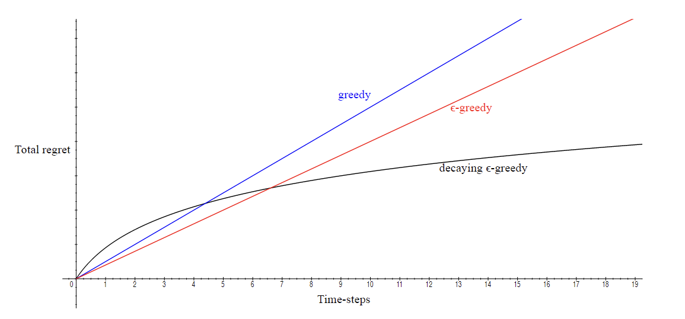

###### Exploration and Exploitation ######

## Exploration vs. Exploitation Dilemma ##

**Exploration** is the process of trying out different actions to learn more about the environment. It is necessary to find the best action to take in the long run.

**Exploitation** is the process of choosing the best action based on the current knowledge. It is necessary to maximize the reward in the short term.

The best long-term strategy may not be the best short-term strategy. We need to balance exploration and exploitation.

- Restaurant Selection
  - Exploitation Go to your favourite restaurant
  - Exploration Try a new restaurant
- Online Banner Advertisements
  - Exploitation Show the most successful advert
  - Exploration Show a different advert
- Game Playing
  - Exploitation Play the move you believe is best
  - Exploration Play an experimental move

## Exploration Principles ##

The action-value function $Q(s, a)$ is an estimate of the expected return when taking action a in state s.

The optimal action-value function $Q^*(s, a) = max_{\pi} Q_{\pi}(s, a)$ is the maximum expected return when taking action a in state s.

We can define _regret_ as the opportunity cost of not selecting the optimal action.

$$l_t = \mathbb{E}[Q^*(s_t, a^*) - Q(s_t, a_t)]$$

The total regret is the sum of the regrets over time.

$$L_T = \mathbb{E}[\sum_{t=1}^{\tau} Q^*(s_t, a^*) - Q(s_t, a_t)]$$

> Maximizing the total reward is equivalent to minimizing the total regret.

The number of times action a is selected in state s is denoted as $N(s, a)$.

A gap is defined as the difference between the value of the optimal action and the value of the action selected.

$$\Delta(s, a) = Q^*(s, a) - Q(s, a)$$

The total regret can be bounded by the number of times action a is selected in state s.

$$L_T \leq \sum_{s, a} N(s, a) \Delta(s, a)$$

It is needed to have small counts for the suboptimal actions to minimize the total regret.

- If an algorithm never explores it will have **linear total regret**

- If an algorithm forever explores (epsilon greedy) it will have **linear total regret**

> Can we have an algorithm that has **sublinear total regret**?

### Naive Exploration ###

**Greedy Algorithm**: Always select the action with the highest estimated value. It can get stuck in a suboptimal action, hence it has linear total regret.

**$\epsilon$-Greedy Algorithm**: With probability $\epsilon$ select a random action, otherwise select the greedy action. Explores forever but it has linear total regret.

### Optimistic Initialisation ###
**Optimistic Initial Values**: Initialize the action-values to high values. It encourages exploration in the beginning but it has linear total regret.

**Decaying $\epsilon$-Greedy Algorithm**: It uses different epsilon values at different times, and the epsilon value change should be scheduled properly. The schedule crafted with the knowledge of the gaps can have sublinear total regret.

$$ c >0 $$
$$ d = min_{a: \Delta(s, a) > 0} \Delta(s, a) $$
$$ \epsilon_t = min \{1,\frac{c|A|}{d^2t}\} $$

### Optimism in the Face of Uncertainty ###
The actions are assumed to have a Gaussian distribution with unknown mean and variance. The algorithm selects the action with the highest variance. The more uncertain the action is, the more important it is to explore it.

***Upper Confidence Bounds***:Estimate an upper bound on the value for each action. The upper confidence depends on the number of times the action is selected.
- Small $N(s, a) \rightarrow$ Large $\hat U(s, a)$ (estimated value is uncertain)
- Large $N(s, a) \rightarrow$ Small $\hat U(s, a)$
(estimated value is accurate)

_Select the action maximizing the upper confidence bound._

$$\hat U(s, a) = Q(s, a) + c \sqrt{\frac{\log t}{N(s, a)}}$$

### Probability Matching ###

The probability of selecting an action is proportional to the estimated value of the action.

Consider a distribution over action-values $p[Q|w]$. Bayesian methods can be used to update the distribution over action-values.

$$P(a) = \frac{e^{Q(s, a)}}{\sum_{b} e^{Q(s, b)}}$$

Better performing actions are selected more often, given the prior knowledge is accurate.

**Thompson Sampling**: Sample the action-values from the posterior distribution and select the action with the highest value.

### Information State Search ###
The algorithm selects the action that maximizes the information gain. Exploration provides more information about the environment.

> Can we quantify the value of information?
> - How much possible reward could be sacrificed to gain information?
> - Which one is more valuable, immediate reward or long-term reward after information gain?

Two drugs are in consideration. The information is probability distribution over the effectiveness of the drugs. Initially, for the first drug, the probability of success is 0.5. The second drug has a probability of success 0.7. The algorithm alters the probabilities based on the outcomes of the actions.

It is again an MDP problem. It can be solved using reinforcement learning algorithms.

-----
#MMI706 - [[Reinforcement Learning]] at [[METU]] 