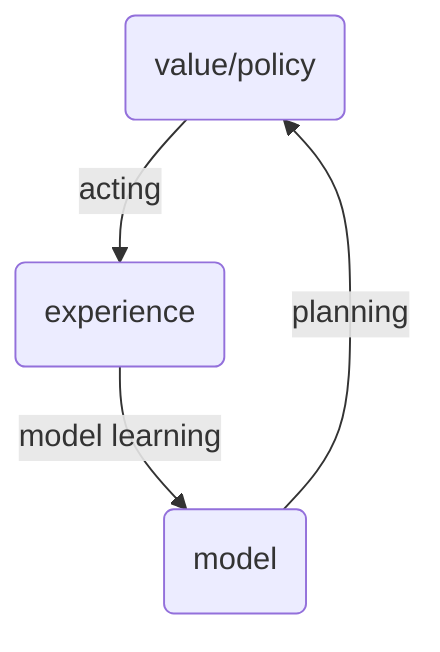
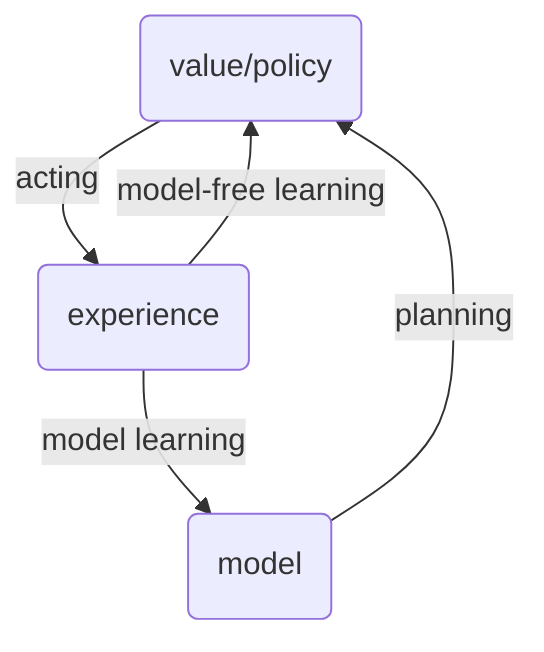
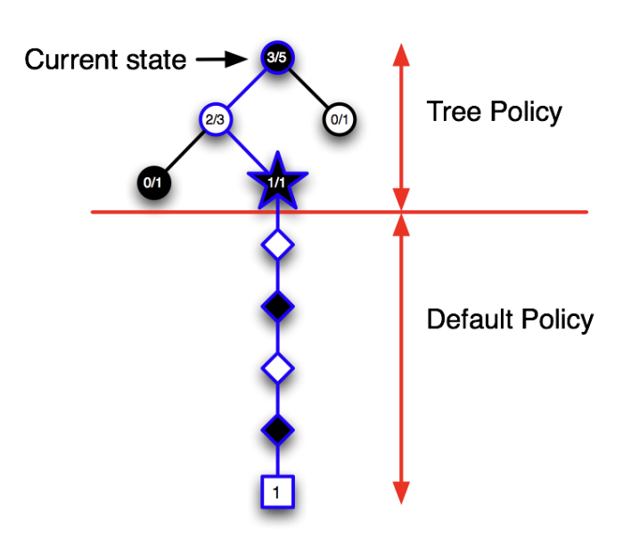

###### Integrating Learning and Planning ######

## Model-Based Reinforcement Learning ##
**Model-Based Reinforcement Learning** is a method that combines the model learning and the policy learning.

- **Previously**: Learn policy directly from the experience.
- **Previously**: Learn the value fucntion directly from the experience.
- **Currently**: Learn the model of the environment from the experience.
- **Currently**: Use the model to simulate the environment and learn the policy from the simulated experience.

> **Model-Free RL**
> - no model of the environment
> -  learn the policy/value function from the experience. 

>
> **Model-Based RL**
> - learn the model of the environment from the experience.
> - plan value function/policy using the model.

------

### **Advantages of Model-Based RL** ###
- **Sample Efficiency**: 
    - Model can generate more experience.
    - Model can generate experience in parallel.
- **Uncertainty**: 
    - Model can be used to estimate the uncertainty of the environment/model.

### **Disadvantages of Model-Based RL** ###
- **Model Bias and Error**:
    - Model is not perfect, can introduce bias.
    - model and value function are two sources of error.
- **Computational Cost**:
    - Model learning and planning are computationally expensive.

----

### **What is the model?** ###
Model $\mathcal{M}$ is a function that predicts the agent's next state and reward given the current state and action. 

$MDP = \langle S, A, P, R, \eta \rangle$

assume that the state $\mathcal{S}$ and action $\mathcal{A}$ are known. $\mathcal{P}$ is the transition probability function, $\mathcal{R}$ is the reward function, and $\eta$ is the discount factor.

### **Model Learning** ###
Objective is to learn the model $\mathcal{M}$ from the experience. It is a supervised learning problem.

- **Model Learning**: 
    - **Input**: $(s, a)$
    - **Output**: $(s', r)$
    - **Loss Function**: $(s', r) - \mathcal{M}(s, a)$

learning $s,a \rightarrow r$ is a regression problem.
learning $s,a \rightarrow s'$ is a density estimation problem. 

A look-up table can be used to represent the model. For each state-action pair, the model stores the next state and reward.

$$S_1 \times A_1 \rightarrow S_2 \times R_1$$
$$S_1 \times A_2 \rightarrow S_3 \times R_2$$
$$ \vdots $$

The table is updated, replacing the old state estimation with the one that results in the higher reward. However, the table can be very large, and it is not practical to store all the state-action pairs.

Another problem is that the sample count is important. If the sample count is low, the model would introduce bias.

#### Planning with inaccurate model ####
Given an imperfect model 〈Pη, Rη〉 6 = 〈P, R〉
Performance of model-based RL is limited to optimal policy.
For approximate MDP 〈S, A, Pη, Rη〉
i.e. Model-based RL is only as good as the estimated model.
When the model is inaccurate, planning process will compute.
a suboptimal policy
- Solution 1: when model is wrong, use model-free RL
- Solution 2: reason explicitly about model uncertainty

------

## Integrated Architectures ##

We consider two sources of experience: real experience and simulated experience.

> **Model-Free RL**
> - no model of the environment
> -  learn the policy/value function from the experience. 

>
> **Model-Based RL**
> - learn the model of the environment from the experience.
> - plan value function/policy using the model.

> **Dyna**
> - learn the model of the environment from the real experience.
> - learn and plan value function/policy using the real and simulated experience.

-----

### Forward Search ###
We have the model of the environment, and we can simulate the environment. However, it is not practical to simulate the environment for all possible actions. Look-ahead search is used to find the best action starting from the current state $s_t$. It is just as solving an MDP.

**Monte-Carlo Tree Seach**: Given a model $\mathcal{M}$, simulate K episodes starting from the current state $s_{t}$ and current simulation policy $\pi$. The tree is expanded by selecting the best action at each state. Build a search tree containing the visited states and actions. _Evaluate_ the value of the states and actions. After the search is finished, select the current action with the highest value.

Each simulation consists of two phases:
- **Tree Policy**: Select the best action at each state.
- **Default Policy**: Select a random action at each state.

Repeat the simulation K times, and update the value of the states and actions.
- **Evaluation**: Update the value of the states and actions.
- **Improvement**: improve the tree policy.

**Temporal-Difference Tree Search**: The idea is to apply TD learning to the simulated experience. The value of the states and actions are updated using TD learning. Which is different than the MC tree search, where here the aim is to use a function approximator to estimate the value of the states and actions.

**Advantages of MC Tree Search**
- Highly selective towards the best actions.
- Can be used with any model, only requires the samples.
- Uses sampling, hence it can break the curse of dimensionality.
- Computational cost can be controlled, parallelisable.

**Advantages of TD Tree Search**
- TD learning reduces the variance, increases the bias.
- TD learning is usually more efficient than MC.

-----
#MMI706 - [[Reinforcement Learning]] at [[METU]]