###### Markov Decision Processes ######

### Markov Process ###

*Markow process* formally describes an environment for reinforcement learning, where the environment is fully observable. The environment's response to an agent's action is probabilistic, and it is described by a set of probabilities. The agent and the environment interact at each of a sequence of discrete time steps. The agent selects an action, and the environment responds by presenting the agent with a reward and the next state. The environment's response at time t depends only on the state and action at time t. The process is described by a 5-tuple, (S, A, P, R, γ), where:

- S is a finite set of states,
- A is a finite set of actions,
- P is a state transition probability matrix,
- R is a reward function, R(s, a, s'),
- γ is a discount factor, γ ∈ [0, 1].

"The future is independent of the past given the present." This is the Markov property.
> **Definition**: A state S(t) is Markov if and only if,  
$\mathbb{P}[S_{t+1} | S_t] = \mathbb{P}[S_{t+1} | S_1, S_2, ..., S_t]$

The state captures all the relevant information from the history. Once the state is known, the history may be thrown away. The state is a sufficient statistic of the future.

--------------------------------------------------------------------------------

### _State Transition Probability Matrix_ ###

For a Markov state $S$, and a next state $S'$, the state transition probability matrix is defined as the probability of transitioning from state $S$ to state $S'$.

$$\mathbb{P}[S_{t+1} = s' | S_t = s] = P_{ss'}$$

The state transition probability matrix, P, is a square matrix of size |S| x |S|, where |S| is the number of states. The element P(s, s') is the probability of transitioning from state s to state s'.

$$P = \begin{bmatrix}
    P_{11} & P_{12} & \cdots & P_{1n} \\
    P_{21} & P_{22} & \cdots & P_{2n} \\
    \vdots & \vdots & \ddots & \vdots \\
    P_{n1} & P_{n2} & \cdots & P_{nn}
\end{bmatrix}$$

Each row of the probability matrix sums to 1, which means that the sum of the probabilites from a single state to all other possible states is 1.

$$\sum_{s'= 1}^{n} P_{ss'} = 1$$

A Markow process is a memoryless random process, where the next state depends only on the current state and not on the sequence of events that preceded it.

> **Definition**: A Markov process (or Markov chain) is a tuple $(S, P)$, where S is a finite set of states, and P is a state transition probability matrix.

**Example**: Consider a simple weather model with 4 states: sunny, cloudy, rainy, and foggy. The state transition probability matrix is given by:

 $$P = \begin{array}{c|cccc}
    & \text{sun} & \text{cloud} & \text{rain} & \text{fog} \\
    \hline
    \text{sun} & 0.8 & 0.1 & 0.1 & 0 \\
    \text{cloud} & 0.2 & 0.6 & 0.1 & 0.1 \\
    \text{rain} & 0.1 & 0.1 & 0.7 & 0.1 \\
    \text{fog} & 0 & 0 & 0 & 1
\end{array}$$

--------------------------------------------------------------------------------

### Markov Reward Process ###

A Markov reward process is a Markov chain with values. It is a tuple $(S, P, R, \gamma)$, where:

- S is a finite set of states,
- P is a state transition probability matrix,
- R is a reward function, $R_s = \mathbb{E}[R_{t+1} | S_t = s]$
- $\gamma$ is a discount factor, $\gamma \in [0, 1]$.

The reward function R(s, s') defines the _immediate reward received after transitioning from state s to state s'_. The discount factor $\gamma$ determines the present value of future rewards.

> **Definition**: A Markov reward process is a tuple $(S, P, R, \gamma)$, where S is a finite set of states, P is a state transition probability matrix, R is a reward function, and $\gamma$ is a discount factor.
> $$R_s = \mathbb{E}[R_{t+1} | S_t = s]$$

> **Definition**: The return $G_t$ is the total discounted reward from time-step t.
> $$G_t = R_{t+1} + \gamma R_{t+2} + \gamma^2 R_{t+3} + ... = \sum_{k=0}^{\infty} \gamma^k R_{t+k+1}$$

Discount factor is the present value of future rewards. It is a value between 0 and 1. The purpose of discounting is to make the sum of rewards finite.

- gamma = 0: the agent is short-sighted "myopic" and only considers immediate rewards.
- gamma = 1: the agent is far-sighted and considers future rewards with equal weight.

Why do we use discount factor ?

- to make reward finite / mathematically well-defined
- to have a stable solution / to avoid infinite rewards in cyclic environments
- to not rely on future rewards due to the uncertainty of the future
- immidiate reward more valuable since it is not delayed
- it is how animals behave in nature

--------------------------------------------------------------------------------

### Value Function ###

The value function $v(s)$ gives the long-term value of state s. It is the expected return starting from state s.

> **Definition**: The state value function $v(s)$ of a Markov reward process is the expected return starting from state s.
> $$v(s) = \mathbb{E}[G_t | S_t = s]$$

The value function is the expected return starting from state s. It estimates how good it is for the agent to be in a particular state. The value function is a prediction of future rewards.

--------------------------------------------------------------------------------

### Bellman Equation ###
The Bellman equation is a fundamental equation in dynamic programming. It decomposes the value function into two parts: immediate reward and discounted value of the next state.

> **Definition**: The Bellman equation for the state value function $v(s)$ is given by:
> $$v(s) = \mathbb{E}[R_{t+1} + \gamma R_{t+2} + \gamma^2 R_{t+3} + ... | S_t = s]$$
> $$v(s) = \mathbb{E}[R_{t+1} + \gamma (R_{t+2} + \gamma R_{t+3} + ...) | S_t = s]$$
> $$v(s) = \mathbb{E}[R_{t+1} + \gamma G_{t+1} | S_t = s]$$
> $$v(s) = \mathbb{E}[R_{t+1} + \gamma v(S_{t+1}) | S_t = s]$$

The Bellman equation expresses the relationship between the value of a state and the values of its successor states. It is a recursive equation that decomposes the value function into two parts: immediate reward and discounted value of the next state.

*Matrix Form*:
$$v = R + \gamma P v$$

$$ \begin{bmatrix}
    v(1) \\
    v(2) \\
    \vdots \\
    v(n)
\end{bmatrix} = \begin{bmatrix}
    R_1 \\
    R_2 \\
    \vdots \\
    R_n
\end{bmatrix} + \gamma \begin{bmatrix}
    P_{11} & P_{12} & \cdots & P_{1n} \\
    P_{21} & P_{22} & \cdots & P_{2n} \\
    \vdots & \vdots & \ddots & \vdots \\
    P_{n1} & P_{n2} & \cdots & P_{nn}
\end{bmatrix} \begin{bmatrix}
    v(1) \\
    v(2) \\
    \vdots \\
    v(n)
\end{bmatrix}$$

The Bellman equation is a linear equation that can be solved for the value function v.

$$v = (I - \gamma P)^{-1} R$$

There are many methods to iteratively solve the Bellman equation, such as monte carlo, dynamic programming, and temporal difference learning.

--------------------------------------------------------------------------------

### Markov Decision Process ###

Markov Decision Process (MDP) is a Markov reward process with decisions. It is a tuple $(S, A, P, R, \gamma)$, where:

- S is a finite set of states,
- **A is a finite set of actions**,
- P is a state transition probability matrix, 
- R is a reward function, $R_s = \mathbb{E}[R_{t+1} | S_t = s]$
- $\gamma$ is a discount factor, $\gamma \in [0, 1]$.

The agent interacts with the environment by taking actions. The agent selects an action, and the environment responds by presenting the agent with a reward and the next state. The environment's response at time t depends on the state and action at time t.

> **Definition**: Policy $\pi$ is a distribution over actions given states,
> $$\pi(a|s) = \mathbb{P}[A_t = a | S_t = s]$$

The policy defines the agent's behavior. It is a distribution over actions given states. The policy can be deterministic or stochastic.

MDP policies depend on the current state, not the history. The agent-environment interaction is a Markov process.

Given a Markov Decision Process (MDP) $M=(S, A, P, R, \gamma)$, and a policy $\pi$,
- The state sequence $S_1, S_2, S_3, ...$ is a Markov process $\langle S, P^{\pi}\rangle>$,
- The state and reward sequence $S_1, R_2, S_2, R_3, S_3, ...$ is a Markov reward process $\langle S, P^{\pi}, R^{\pi}, \gamma \rangle$.

$$P^{\pi}_{ss'} = \sum_{a \in A} \pi(a|s) P_{ss'}^a$$
$$R^{\pi}_s = \sum_{a \in A} \pi(a|s) R_s^a$$

--------------------------------------------------------------------------------

### Value Function with Policy ###

The value function $v_{\pi}(s)$ gives the long-term value of state s under policy $\pi$. It is the expected return starting from state s, following policy $\pi$.

> **Definition**: The **state-value function** $v_{\pi}(s)$ of a Markov Decision Process (MDP) is the expected return starting from state s, following policy $\pi$.
> $$v_{\pi}(s) = \mathbb{E}_{\pi}[G_t | S_t = s]$$

> **Definition**: The **action-value function** $q_{\pi}(s, a)$ of a Markov Decision Process (MDP) is the expected return starting from state s, taking action a, and following policy $\pi$.
> $$q_{\pi}(s, a) = \mathbb{E}_{\pi}[G_t | S_t = s, A_t = a]$$

The value function is the expected return starting from state s, following policy $\pi$. It estimates how good it is for the agent to be in a particular state under policy $\pi$. The value function is a prediction of future rewards.

--------------------------------------------------------------------------------

### Bellman Equation with Policy ###

The Bellman equation with policy is a fundamental equation in dynamic programming. It decomposes the value function into two parts: immediate reward and discounted value of the next state under policy $\pi$.
 
 - State-Value Function:

    - $v_{\pi}(s) = \mathbb{E}_{\pi}[R_{t+1} + \gamma v_{\pi}(S_{t+1}) | S_t = s]$

- Action-Value Function:

    - $q_{\pi}(s, a) = \mathbb{E}_{\pi}[R_{t+1} + \gamma q_{\pi}(S_{t+1}, A_{t+1}) | S_t = s, A_t = a]$

```mermaid 
%%{init: { "flowchart": { "htmlLabels": true, "curve": "linear" } } }%%
graph TB
    subgraph  4.[4.]
    direction TB
    style 4. color:#000, fill:#fff, stroke:#ddd;
    style a6 fill:#222,stroke:#333,stroke-width:2px;
    style a7 fill:#222,stroke:#333,stroke-width:2px;
    style a8 fill:#222,stroke:#333,stroke-width:2px;
    style a9 fill:#222,stroke:#333,stroke-width:2px;
    style a10 fill:#222,stroke:#333,stroke-width:2px;
    style s10  fill:#fff,stroke:#333,stroke-width:2px;
    style s11 fill:#fff,stroke:#333,stroke-width:2px;
    a6(( )) --- s10(( ))
    a6 --- s11(( ))
    s11 --- a7(( ))
    s11 --- a8(( ))
    s10 --- a9(( ))
    s10 --- a10(( ))
    end
    subgraph  3.[3.]
    direction TB
    style 3. color:#000, fill:#fff, stroke:#ddd;
    style a4 fill:#222,stroke:#333,stroke-width:2px;
    style a5 fill:#222,stroke:#333,stroke-width:2px;
    style s5  fill:#fff,stroke:#333,stroke-width:2px;
    style s6 fill:#fff,stroke:#333,stroke-width:2px;
    style s7 fill:#fff,stroke:#333,stroke-width:2px;
    style s8 fill:#fff,stroke:#333,stroke-width:2px;
    style s9 fill:#fff,stroke:#333,stroke-width:2px;
    s5(( )) --- a4(( ))
    s5 --- a5(( ))
    a5 --- s6(( ))
    a5 --- s7(( ))
    a4 --- s8(( ))
    a4 --- s9(( ))
    end
    subgraph  2.[2.]
    direction TB
    style 2. color:#000, fill:#fff, stroke:#ddd;
    style a3 fill:#222,stroke:#333,stroke-width:2px;
    style s3 fill:#fff,stroke:#333,stroke-width:2px;
    style s4 fill:#fff,stroke:#333,stroke-width:2px;
    style h2 fill:#fff,stroke:#fff;
    a3(( )) --- s3(( ))
    a3 --- s4(( ))
    s4 --- h2(( ))
    linkStyle 14 stroke:#fff,stroke-width:2px;
    end
    subgraph  1.[1.]
    direction TB
    style 1. color:#000, fill:#fff, stroke:#ddd;
    style a2 fill:#222,stroke:#333,stroke-width:2px;
    style a1 fill:#222,stroke:#333,stroke-width:2px;
    style s1 fill:#fff,stroke:#333,stroke-width:2px;
    style h1 fill:#fff,stroke:#fff;
    s1((  )) --- a1(( ))
    s1 --- a2(( ))
    a2 --- h1(( ))
    linkStyle 17 stroke:#fff,stroke-width:2px;
    end
``` 

1. $$v_{\pi}(s) = \sum_{a \in A} \pi(a|s) q_{\pi}(s, a)$$
2. $$q_{\pi}(s, a) = R_s^a + \gamma \sum_{s' \in S} P_{ss'}^a v_{\pi}(s')$$
3. $$v_{\pi}(s) = \sum_{a \in A} \pi(a|s) (R_s^a + \gamma \sum_{s' \in S} P_{ss'}^a v_{\pi}(s'))$$
4. $$q_{\pi}(s, a) = R_s^a + \gamma \sum_{s' \in S} P_{ss'}^a \sum_{a' \in A} \pi(a'|s') q_{\pi}(s', a')$$

-----
#MMI706 - [[Reinforcement Learning]] at [[METU]]