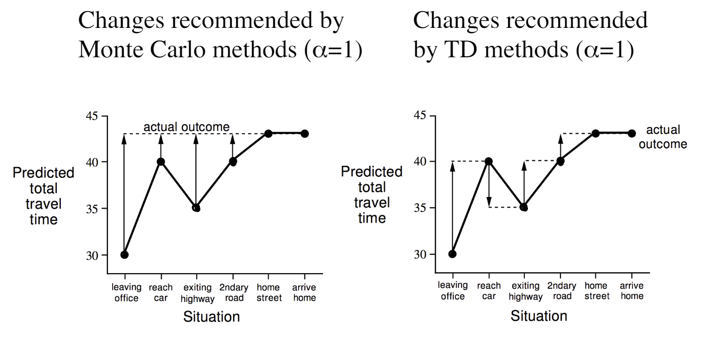

###### Model-Free Prediction ######

## Monte-Carlo (MC) Prediction ##

In Monte-Carlo (MC) prediction, we learn the value function directly from the experience of complete episodes. The update is done at the end of each episode, so there is no bootstrapping. The episode should be complete, meaning the agent should reach a terminal state.

The algorithm is only applicable to episodic tasks, meaning that we need complete episodes to compute the return and update the value function.

**Return** is the sum of rewards from the current time step to the end of the episode. Return can have discounted rewards, but it is not necessary.

$$G_t = R_{t+1} + \gamma R_{t+2} + \gamma^2 R_{t+3} + \dots + \gamma^{T-t-1} R_T$$

The value of a state under policy $\pi$ is the expected return from that state.

$$V^\pi(s) = \mathbb{E}[G_t | S_t = s]$$

### Incremental Monte-Carlo Update ###
The update rule for the value function is the same as the update rule for the value function approximation. The update rule is based on the difference between the return and the current estimate of the value function.

$$V(S_t) \leftarrow V(S_t) + \frac{1}{N(S_t)} (G_t - V(S_t))$$

where $N(S_t)$ is the number of times state $S_t$ has been visited.

Running mean can be used to update the value function incrementally.

$$V(S_t) \leftarrow V(S_t) + \alpha (G_t - V(S_t))$$

where $\alpha$ is the step size or learning rate.

## Temporal Difference (TD) Prediction ##

In Temporal Difference (TD) prediction, we learn the value function by bootstrapping from the current estimate of the value function. The update is done at each time step, so there is bootstrapping. The episode does not need to be complete, meaning the agent can learn from incomplete sequences. 

> TD predictions is a guess towards a guess.

**Incremental Every-Visit MC**: $V(S_t) \leftarrow V(S_t) + \alpha (G_t - V(S_t))$

**TD(0)**: $V(S_t) \leftarrow V(S_t) + \alpha (R_{t+1} + \gamma V(S_{t+1}) - V(S_t))$

Here, we can see the difference between Monte-Carlo and Temporal Difference prediction. In Monte-Carlo prediction, the value function is updated at the end of the episode, whereas in Temporal Difference prediction, the value function is updated at each time step. The Monte-Carlo prediction is more accurate but has higher variance, whereas the Temporal Difference prediction is less accurate but has lower variance.

$$ G_t = R_{t+1} + \gamma R_{t+2} + \gamma^2 R_{t+3} + \dots + \gamma^{T-t-1} R_T$$

is the unbiased estimate of the $V_\pi(S_t)$.

$$ G_{t+1} = R_{t+2} + \gamma R_{t+3} + \gamma^2 R_{t+4} + \dots + \gamma^{T-t-1} R_T$$

$$ \gamma G_{t+1} = \gamma R_{t+2} + \gamma^2 R_{t+3} + \dots + \gamma^{T-t-1} R_T + \gamma^{T-t} R_T$$

$$ G_t = R_{t+1} + \gamma G_{t+1}$$

Hence, TD target $R_{t+1} + \gamma V_\pi(S_{t+1})$ is also an unbiased estimate of the $V_\pi(S_t)$.

However, the TD target $R_{t+1} + \gamma V(S_{t+1})$ is a biased estimate of the $V_\pi(S_t)$.

### Unified View ###
Monte-Carlo Backup: 
$$V(s_t) \leftarrow V(s_t) + \alpha (G_t - V(s_t))$$

Temporal Difference Backup:
$$V(s_t) \leftarrow V(s_t) + \alpha (R_{t+1} + \gamma V(s_{t+1}) - V(s_t))$$

Dynamic Programming Backup:
$$V(s_t) \leftarrow \mathbb{E}_\pi[R_{t+1} + \gamma V(s_{t+1}) | S_t = s_t]$$

### Bootstrapping and Sampling ###

**Bootstrapping**: Update the value function based on the current estimate of the value function.
- MC does not bootstrap
- TD bootstraps
- DP bootstraps

**Sampling**: Update the value function based on the actual returns.
- MC samples
- TD samples
- DP does not sample

### TD($\lambda$) Prediction with Forward View ###
The $\lambda$-return is a weighted sum of all returns, where the weight decays exponentially with the time difference.

$$G_t^\lambda = (1-\lambda) \sum_{n=1}^{\infty} \lambda^{n-1} G_t^{(n)}$$

Like MC the forward view of TD($\lambda$) requires the complete episode.

### TD($\lambda$) Prediction with Backward View ###
Forward view provides the theoretical foundation for TD($\lambda$), but it is not practical. The backward view is more practical and is used in practice.

Backward view provides the mechanism to compute the $\lambda$-return incrementally.

### Eligibility Traces ###

Eligibility traces are a key concept in reinforcement learning that help bridge the gap between Monte Carlo methods and Temporal Difference (TD) learning. They allow for more efficient learning by combining the strengths of both approaches. When used with policy gradients, eligibility traces can help improve the learning process in policy-based reinforcement learning algorithms.

- Frequency Heuristic: The more frequently a state is visited, the more important it is.
- Recency Heuristic: The more recently a state is visited, the more important it is.

$$E_0(s) = 0$$

$$E_t(s) = \gamma \lambda E_{t-1}(s) + 1(S_t = s)$$

$$\delta_t = R_{t+1} + \gamma V(S_{t+1}) - V(S_t)$$

$$V(s) \leftarrow V(s) + \alpha \delta_t E_t(s)$$

> If the $TD(\lambda)$ updates are done after each time step, _online updates_
> 
> If the updates are accumulated and done at the end of the episode, _offline updates_

-----
#MMI706 - [[Reinforcement Learning]] at [[METU]]