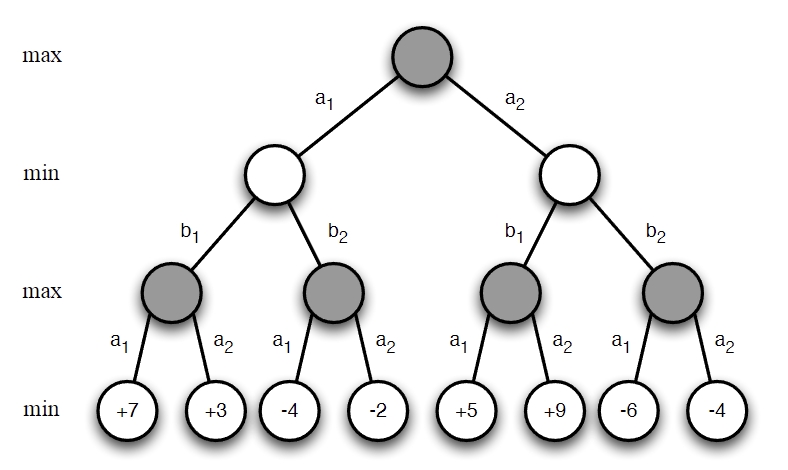

###### RL in Classic Games ######

## Optimality in Games ##

Optimal strategies in games are usually defined as the strategies that maximize the expected return. In games with multiple players, the optimal strategy depends on the strategies of the other players.

If the opponents have fixed strategies, the optimal strategy can be found. We can treat the opponents as part of the environment and solve the game as a single-agent problem. This is the case in games like Tic-Tac-Toe, where the opponent is following a fixed strategy.

> **Nash Equilibrium:** Is a joint policy where no player can improve their expected return by unilaterally changing their strategy. 
> 
> lets say that optimal policy for player i is $\pi^i$
> 
> if all other players fix their strategies to $\pi^{-i}$
> Best response for player i is 
> $$\pi^i = \pi_*^i(\pi^{-i})$$
> This is the _Nash Equilibrium_

An example of a game with Nash Equilibrium is the Rock-Paper-Scissors game. If the opponent is playing randomly, the optimal strategy is to play randomly as well. In this case, the Nash Equilibrium is the uniform distribution over the actions. However, if the opponent is playing a fixed strategy, let's say always rock, the optimal would be to play paper. In this case, the rock player will always lose, and the paper player will always win, hence the Nash Equilibrium is not achieved.

Nash equilibrium is the best an agent can do in a game.

_Best response is solution to single-agent RL problem_
- Other players become part of the environment
- Game is reduced to an MDP
- Best response is optimal policy for this MDP

Nash equilibrium can be found by solving the game as a single-agent problem. The agent can learn the optimal strategy by playing against itself. This is called self-play.

Learning and adapting to the self-played games is a common approach to find the optimal strategy in games.
Each agent learns best response to other players. One player’s policy determines another player’s environment. All players are adapting to each other.

> *Is the Nash Equilibrium unique?*
> - In general, no. For some games there is a unique Nash Equilibrium (two-player zero-sum games).

## Two-Player Zero-Sum Games ##

- A _two-player_ game has two alternating players
- A _zero-sum_ game is a game where the sum of the rewards is zero
$$R^1 + R^2 = 0$$

The reward of one player is the negative of the reward of the other player. The condition of a player to do better is the other player to do worse.

Both players are fighting against each other. The reward of one player is the loss of the other player.

## Game Theory ##
Game theory is the study of strategic interactions between rational agents.

**There are two ways of finding Nash equilibria in two-player zero-sum games:**
- Game tree search
- Self-play reinforcement learning

A _perfect information game_ is a game where all players know the state of the game at all times. 
- Chess
- Checkers
- Go
- Backgammon

An _imperfect information game_ is a game where players don't know the state of the game at all times.
- Poker
- Scrabble

## MiniMax ##

Value function defining the expected total reward given joint policies $\pi = \langle \pi^1, \pi^2 \rangle$:

$$V_\pi = E_{\pi}[G_t | S_t = s]$$

A minimax value function maximizes white's expected return while minimizing black's expected return.

$$v_{*}(s)= max_{\pi^1} min_{\pi^2}v_\pi(s)$$

A minimax policy is a Nash equilibrium.

### MiniMax Search Example ##

The minimax algorithm is used in decision-making and game theory to minimize the possible loss for a worst-case scenario. When dealing with two players, one aims to maximize their score (max player), and the other aims to minimize the score (min player).

### Tree Structure ###
The tree has different levels, alternating between max and min:

### Steps to Evaluate the Tree ###
1. **Leaf Nodes**: Start by evaluating the leaf nodes. These are the final payoffs at the end of the game.
2. **Max Level (Third Level)**:
   - Nodes under $ b_1 $:
     - $ +7 $ and $ +3 $ lead to choosing the maximum, which is $ +7 $.
     - $ -4 $ and $ -2 $ lead to choosing the maximum, which is $ -2 $.
   - Nodes under $ b_2 $:
     - $ +5 $ and $ +9 $ lead to choosing the maximum, which is $ +9 $.
     - $ -6 $ and $ -4 $ lead to choosing the maximum, which is $ -4 $.

3. **Min Level (Second Level)**:
   - Nodes under $ a_1 $:
     - $ +7 $ and $ -2 $ lead to choosing the minimum, which is $ -2 $.
   - Nodes under $ a_2 $:
     - $ +9 $ and $ -4 $ lead to choosing the minimum, which is $ -4 $.

4. **Max Level (Top Level)**:
   - Nodes under $ a_1 $ and $ a_2 $:
     - $ -2 $ and $ -4 $ lead to choosing the maximum, which is $ -2 $.

- The root node is evaluated based on the decisions made by the max player considering the min player's responses.
- The optimal value at the root node (topmost node) is $ -2 $, which indicates that with optimal play from both sides, the max player's best outcome would be $ -2 $.

Main problem is the exponential growth of the tree. The number of nodes in the tree is $ b^d $, where $ b $ is the branching factor and $ d $ is the depth of the tree.

Use value function to estimate minimax value at leaf nodes.

Minimax search run to fixed depth with respect to leaf values.

## Self-Play Temporal-Difference Learning ##

The idea is to use basic RL methods to self-play games and learn the optimal strategy. We need to change the definition of the game to self play.

- **MC**: update value function towards the return $ G_t $
  $$
  \Delta \mathbf{w} = \alpha (G_t - v(S_t, \mathbf{w})) \nabla_\mathbf{w} v(S_t, \mathbf{w})
  $$

- **TD(0)**: update value function towards successor value $ v(S_{t+1}) $
  $$
  \Delta \mathbf{w} = \alpha (v(S_{t+1}, \mathbf{w}) - v(S_t, \mathbf{w})) \nabla_\mathbf{w} v(S_t, \mathbf{w})
  $$

- **TD$(\lambda)$**: update value function towards the $\lambda$-return $ G_t^\lambda $
  $$
  \Delta \mathbf{w} = \alpha (G_t^\lambda - v(S_t, \mathbf{w})) \nabla_\mathbf{w} v(S_t, \mathbf{w})
  $$

### Simple TD ###
- Update value function towards the successor value
- Value function approximator is a linear function of the state
- Value function backed up from raw value at the next state

### TD Root  ###
- Update value function towards successor _search_ value
- Search value is computed at the root of the tree
- Value function backed up from the search value at the next state

### TD Leaf ###
- Update value function towards the leaf value
- Value function backed up from the leaf value at the next state

### TreeStrap ###
- Update the search values towards deeper search values
-minimax search value is computed at all nodes
- Value function backed up from the search value at the same step, for all nodes

### Simulation-Based Search ###
- Self-play rl can replace search
- Simulation of self-play games from the root state
- Apply RL to simulated games

-----
#MMI706 - [[Reinforcement Learning]] at [[METU]]